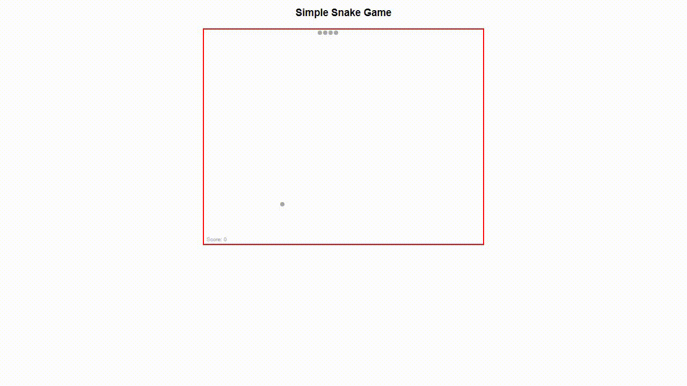

# Snake Game

## Galery


## Overview
Welcome to the Snake Game! This classic arcade game is implemented using HTML, CSS, and JavaScript. Test your reflexes and see how long you can guide the snake to eat apples and grow without colliding with the walls or yourself.

## Features
* __Classic Gameplay__: Experience the timeless gameplay of the Snake Game.
* __Responsive Design__: Play seamlessly on different devices with a responsive layout.
* __Score Tracking__: Keep track of your score as you devour apples and extend the length of your snake.

## How to Play
1. Clone the repository to your local machine:

```
git clone https://github.com/nferdica/snake-game.git
```
2. Open the `index.html` file in your web browser.

3. Use the arrow keys to control the snake's direction:
* __Up Arrow__: Move Up
* __Down Arrow__: Move Down
* __Left Arrow__: Move Left
* __Right Arrow__: Move Right

4. Eat the apples to grow longer and avoid collisions to survive.

## File Structure
* __index.html__: The main HTML file containing the structure of the game.
* __style.css__: The CSS file for styling the game layout.
* __script.js__: The JavaScript file containing the game logic.

## Contributions
Contributions are welcome! If you find any issues or have suggestions for improvements, feel free to open an issue or create a pull request.

## License
This Snake Game is open-source and available under the MIT License.

Feel free to explore and modify the JavaScript file to add additional features or customize the behavior of the tabs.

For any questions or issues, please open an issue on the GitHub repository.

Happy coding!